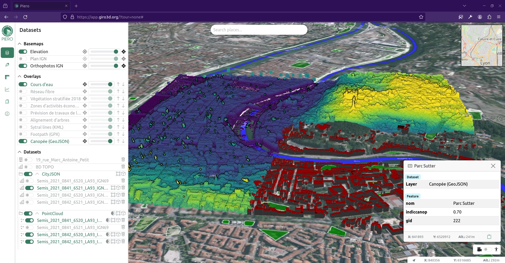
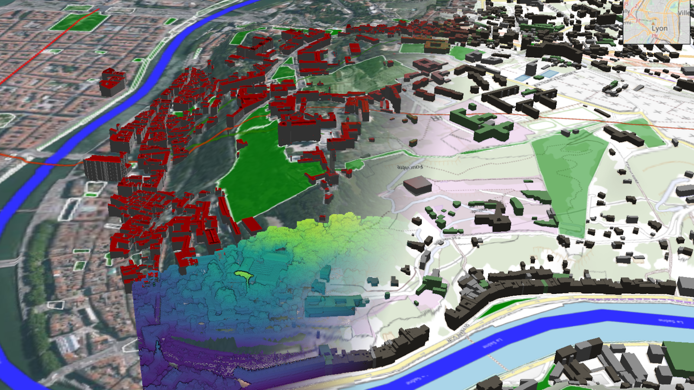
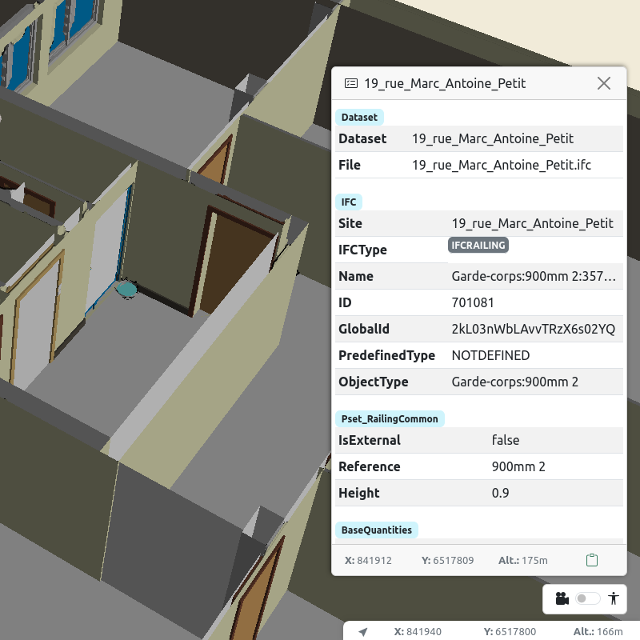
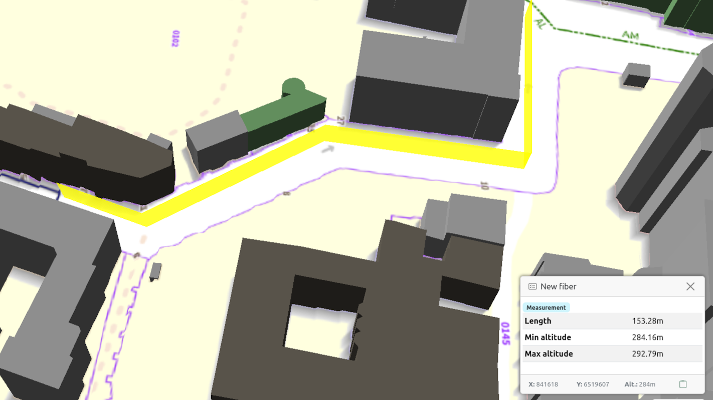
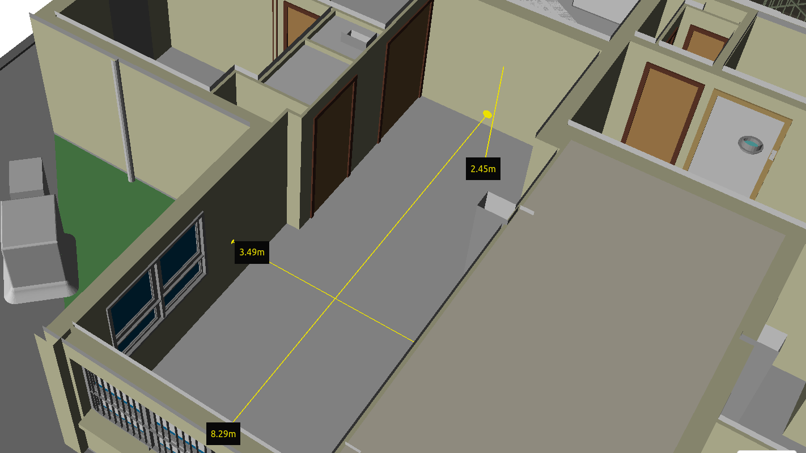
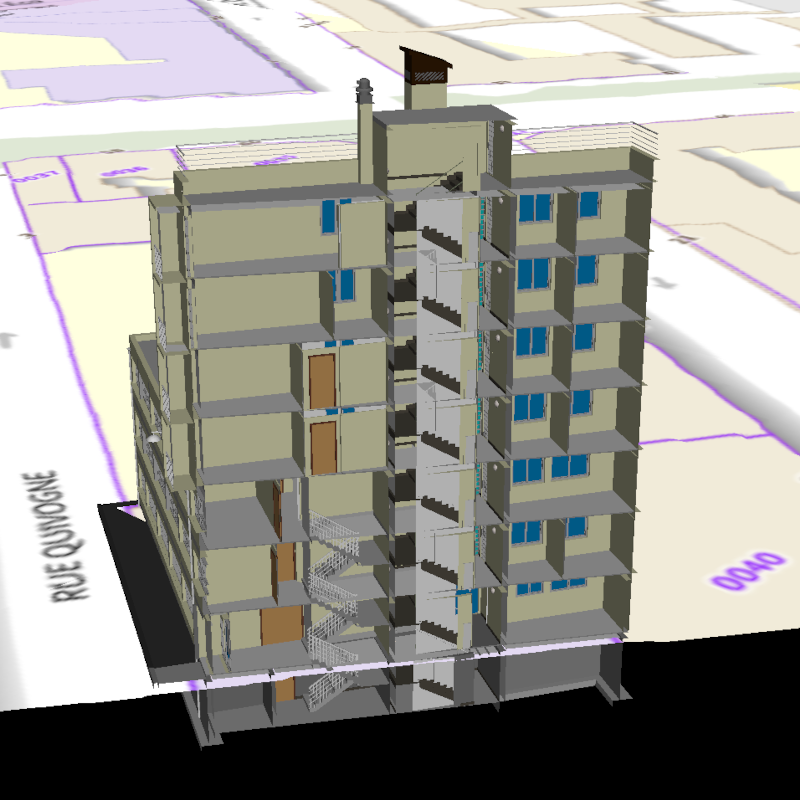
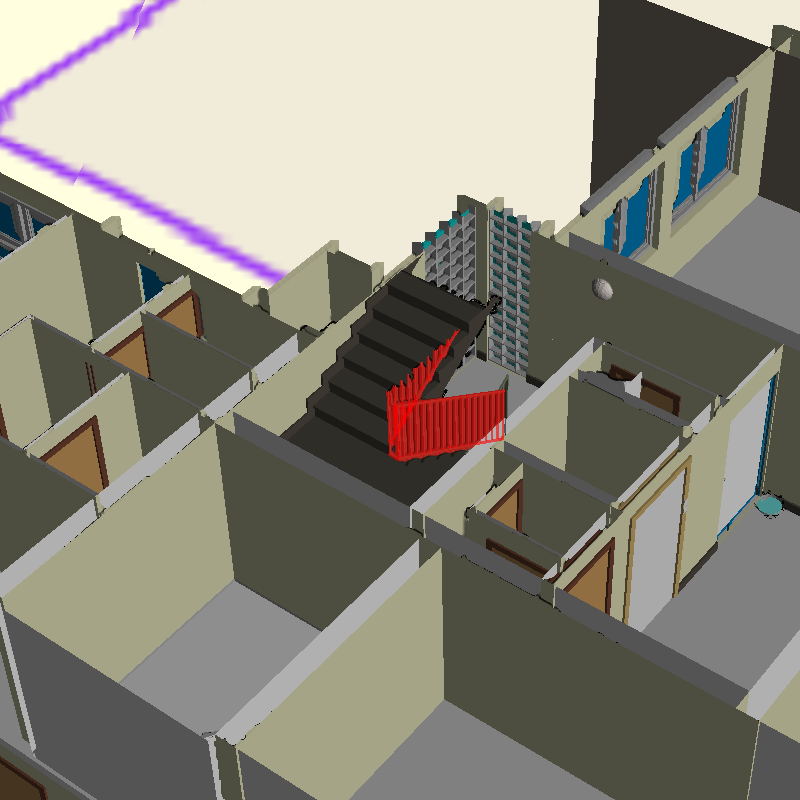

# Piero

<div align="center">
  <a href="https://app.giro3d.org">
    
  </a>
</div>

<div align="center">
  A versatile web application to visualize 3D geospatial data in the browser.
</div>

<br>

<div align="center">
  <a href="https://gitlab.com/giro3d/piero/badges/main/pipeline.svg"></a>
  <a href="https://matrix.to/#/#giro3d:matrix.org"></a>
</div>



---

## Bring Your Own Data

Piero is powered by **[Giro3D](https://giro3d.org/)** and supports a variety of heterogeneous data sources, either 2D and 3D. The application comes with some sample data, you can add your own data via drag and drop from your computer to visualize it.



### Imagery

-   [Cloud Optimized GeoTIFF (COG)](https://www.cogeo.org/)
-   [MVT](https://docs.mapbox.com/data/tilesets/guides/vector-tiles-standards/)
-   [WMS](https://www.ogc.org/standard/wms/)
-   [WMTS](https://www.ogc.org/standard/wmts/)

### 2D assets

-   [GeoJSON](https://geojson.org/)
-   [GeoPackage](https://www.geopackage.org/)
-   [GPX](https://www.topografix.com/gpx.asp) - not yet supported via drag and drop
-   [KML](https://www.ogc.org/standard/kml/) - not yet supported via drag and drop
-   [Shapefile](https://doc.arcgis.com/en/arcgis-online/reference/shapefiles.htm) - not supported via drag and drop

### 3D assets

-   [3D Tiles](https://www.ogc.org/standard/3DTiles/) - not supported via drag and drop
-   [CityJSON](https://www.cityjson.org/)
-   [CSV pointcloud](https://github.com/ASPRSorg/LAS)
-   [IFC](https://www.buildingsmart.org/standards/bsi-standards/industry-foundation-classes/)
-   [LAS/LAZ pointcloud](https://github.com/ASPRSorg/LAS)
-   [PLY](https://paulbourke.net/dataformats/ply/) - not supported via drag and drop

### Extend

Piero can easily be extended to include any format supported by [Giro3D](https://giro3d.org) or [Three.js](https://threejs.org/). See [Run your own Piero](#run-your-own-piero).

## Features

Besides displaying 2D and 3D data, Piero adds some more advanced tools to navigate and analyze your data.

### Identification & Attribute table

By clicking on your data, you can easily get all the metadata from your objects. Supports a wide variety of metadata, among IFC properties, GeoJSON properties, WFS fields, CityJSON attributes, etc.



### Geocoding

Piero includes a geocoding widget from [the French BAN database](https://adresse.data.gouv.fr/) to easily set the view on an addresse or point of interest.

### Bookmarks

**Bookmarks** let you save and share the current 3D view so that you can easily get back to a point of interest.

### 3D annotations

**3D annotations** let you place points, and draw lines and polygons on the map or on any 3D data. You can also import your own 3D GeoJSON files.



### Measurements

When dealing with buildings, it can be very useful to automagically determine the length between two objects. **Measurements** let you easily measure distances between walls and store the results.



### Cross section

The **cross section** tool let you define a cross-section plane to see through 3D objects.



### Clipping box

The **clipping box** tool let you partially hide objects, so you can see through them. This can be useful to see inside a building, for instance displaying a single floor.



## Run your own Piero

### Setup

You'll simply need to checkout this application and edit the configuration.

```bash
# Clone the app
git clone https://gitlab.com/giro3d/piero.git
cd piero
```

On compatible platforms, you can use the `init.sh` script to initialize the configuration; otherwise initialize it manually:

1. Install npm dependencies
    ```sh
     npm install
    ```
2. Copy the default app configuration
    ```sh
     cp src/config.ts.sample src/config.ts
     cp src/styles.ts.sample src/styles.ts
    ```

If you want to learn more about the configuration, head up to [its documentation](./CONFIGURATION.md).

### Run

Run the app with `npm run start`: it should be available at <http://localhost:8080/>.

To deploy the app, simply build it; the static web application will be available in the `dist` folder - it can then be copied to your server:

```bash
npm run build -- --base https://mydomain.com/piero
```

## Contributing

Contributions are welcomed. We follow the same guidelines as [Giro3D](https://gitlab.com/giro3d/giro3d/-/blob/main/CONTRIBUTING.md).

## Governance

The Piero project is part of [Giro3D](https://giro3d.org), and follows the same governance as [Giro3D](https://giro3d.org/governance.html).

## FAQ

### Where does the name Piero come from ?

The name is a reference to the italian artist and mathematician [Piero della Francesca](https://en.wikipedia.org/wiki/Piero_della_Francesca). It was suggested by Loïc Bartoletti and won the community poll for the name of the application.
